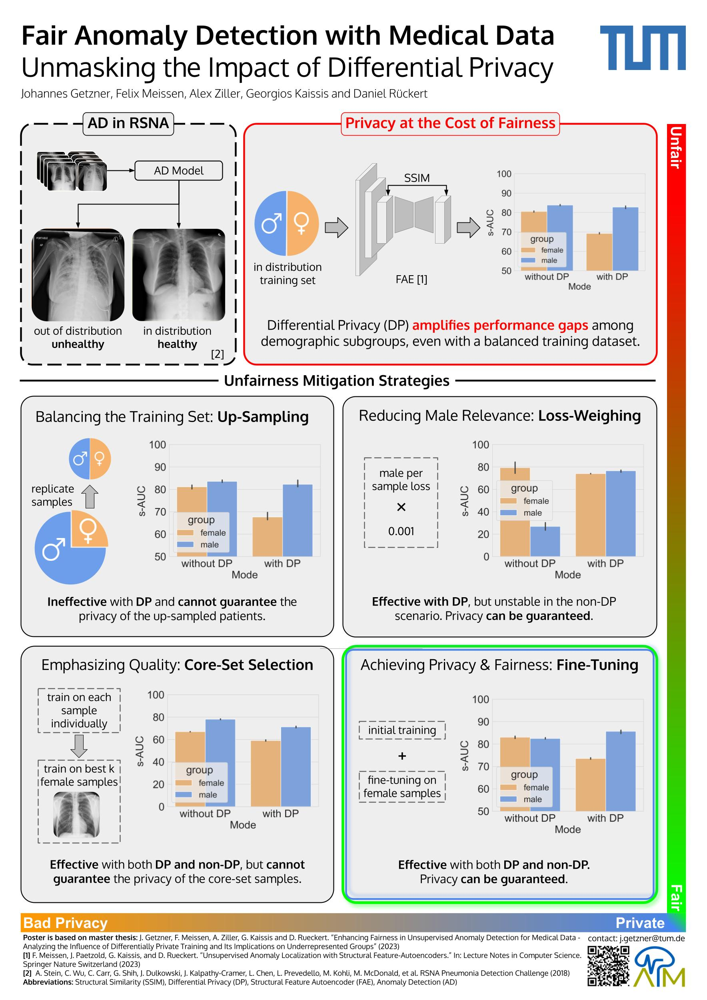

# Enhancing Fairness in Unsupervised Anomaly Detection for Medical Data - Analyzing the Influence of Differentially Private Training and Its Implications on Underrepresented Groups
This repository contains the sourcecode to my master thesis.
## Repository Structure


- **./src** contains the new sourcecode for the thesis (DISCLAIMER: clean structure, but not fully tested and might contain some bugs)
    - **./src/datasets** contains the wrapper classes for the datasets
    - **./src/models** contains the models
    - **./src/plotting** contains the code used to plot the graphs and charts in the thesis
    - **./src/trainer** contains the wrappers for training the models with and without DP
    - **./src/utils** contains the code to compute the metrics and other utilities
- **./(archived) src** contains the sourcecode for the deprecated version of the thesis  (INFO: messy, but fully tested and working)
    - **./src/data** contains the code to prepare and load the datasets
    - **./src/datasets** should contain the actual datasets, see the required structure of data directories in the corresponding files to load the data
    - **./src/analysis** contains the script to plot the results
    - **./src/models** contains the models
    - **./src/utils** contains the code to compute the metrics, training loops and other utilities
    - **./train.py** is the main script to train the models and the entry point for the different experiment configurations
## Requirements
To install the necessary packages run the following command:

```conda env create -f environment.yml```


## About the Thesis
The integration of deep learning in medical imaging has shown significant promise in enhancing diagnostic capabilities and addressing the growing need for efficient analysis of increasing volumes of medical data. Specifically, Unsupervised Anomaly Detection (UAD) alleviates large labelling efforts by training exclusively on unlabeled in-distribution data and detecting outliers as anomalies. However, the application of deep learning models in healthcare has unveiled a susceptibility to biases inherent in the training data, potentially leading to unfair predictions and disparities, especially concerning underrepresented demographic groups. Furthermore, the adoption of Differential Privacy through DP-SGD [1], a state-of-the-art framework which provides mathematical guarantees for maintaining the privacy of the individuals whose data was used in the training of a model, greatly exacerbates performance discrepancies, unfairly widening the performance gap between demographic subgroups. This thesis, using the RSNA Pneumonia Detection Challenge dataset [2] and the FAE [3] UAD model, rigorously investigates the extent to which DP impacts fairness, revealing that while DP protects privacy, it also worsens subgroup disparities. In response to this problem, we first measured the performance gaps amongst demographic subgroups with and without DP, and then implemented and assessed various mitigation strategies designed to strengthen fairness while sustaining privacy and model performance. Our discussion encompasses both the effectiveness of the mitigation strategies and their practical implications. As such, the findings of this thesis contribute to the advancement of privacy-preserving, fairness-enhancing techniques in medical data analysis, offering insights and solutions to mitigate the exacerbated fairness gaps induced by DP training in UAD.

[1] M. Abadi, A. Chu, I. Goodfellow, H. B. McMahan, I. Mironov, K. Talwar, and L. Zhang. “Deep Learning with Differential Privacy.” In: Proceedings of the 2016 ACM SIGSAC Conference on Computer and Communications Security. CCS’16. ACM, Oct. 2016. doi: 10.1145/2976749.2978318.<br />
[2] A. Stein, C. Wu, C. Carr, G. Shih, J. Dulkowski, J. Kalpathy-Cramer, L. Chen, L. Prevedello, M. Kohli, M. McDonald, et al. RSNA Pneumonia Detection Challenge. 2018.<br />
[3] F. Meissen, J. Paetzold, G. Kaissis, and D. Rueckert. “Unsupervised Anomaly Localization with Structural Feature-Autoencoders.” In: Lecture Notes in Computer Science. Springer Nature Switzerland, 2023, pp. 14–24. isbn: 9783031338427. doi: 10.1007/978-3-031-33842-7_2.
### Poster
